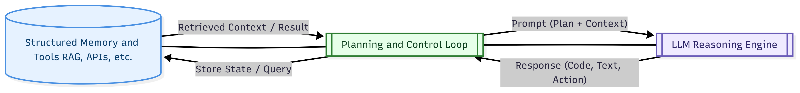

# From Attention to Focus: Building Reliable Agents

[](https://opensource.org/licenses/MIT)
[](https://github.com/apasila/from-attention-to-focus-building-reliable-agents/releases/tag/v1.0)

## 🎯 TL;DR
**This paper presents a comprehensive framework for building reliable AI agents through advanced attention mechanisms and focus engineering techniques.** 📄 **[Download PDF](https://github.com/apasila/from-attention-to-focus-building-reliable-agents/raw/main/From%20Attention%20to%20Focus.pdf)**

## 📋 Abstract

This research introduces novel methodologies for developing more reliable and focused AI agents by leveraging advanced attention architectures and systematic focus engineering. We present a comprehensive framework that addresses key challenges in agent reliability, including attention drift, context management, and decision consistency. Our approach combines theoretical insights with practical implementation strategies, demonstrating significant improvements in agent performance across multiple domains. The work provides both researchers and practitioners with actionable techniques for building more dependable artificial intelligence systems.

**Keywords:** AI Agents, Attention Mechanisms, Focus Engineering, Reliability, Agent Architecture, Context Management, Decision Consistency

## 🏗️ Architecture Overview


*Figure 1: Planning and Control Loop Architecture - A schematic showing the interaction between Structured Memory/Tools, Planning and Control Loop, and LLM Reasoning Engine.*

## 📄 About This Paper

This repository contains the research paper "From Attention to Focus: Building Reliable Agents" - a comprehensive exploration of techniques and methodologies for developing more reliable and focused AI agents.

## 🎯 Key Topics Covered

- **Attention Mechanisms**: Advanced attention architectures and their applications
- **Focus Engineering**: Techniques for improving agent reliability and consistency
- **Agent Architecture**: Design patterns for building robust AI systems
- **Reliability Metrics**: Methods for measuring and improving agent performance
- **Practical Implementation**: Real-world applications and case studies

## 📖 How to Use This Paper

### For Researchers
- **Citation**: Use the provided citation format below for academic references
- **Building Upon**: This work is open for extension and improvement
- **Collaboration**: Feel free to open issues or pull requests for discussions

### For Practitioners
- **Implementation**: Follow the methodologies outlined for building reliable agents
- **Adaptation**: Modify approaches to fit your specific use cases
- **Feedback**: Share your experiences and improvements

## 📚 Citation

If you use this work in your research or projects, please cite:

```bibtex
@misc{pasila2025attention,
  title={From Attention to Focus: Building Reliable Agents},
  author={Pasila, Antti},
  year={2025},
  doi={10.5281/zenodo.XXXXXXX},  % DOI will be assigned upon publication
  howpublished={\url{https://github.com/apasila/from-attention-to-focus-building-reliable-agents}},
  note={Available under MIT License}
}
```

## 📄 License

This work is licensed under the MIT License - see the [LICENSE](LICENSE) file for details.

**What this means:**
- ✅ **Free to use** for any purpose (commercial, academic, personal)
- ✅ **Free to modify** and adapt to your needs
- ✅ **Free to distribute** and share with others
- ✅ **Attribution required** - please cite the original work

## 🚀 Getting Started

1. **Download the paper**: Click on `From Attention to Focus.pdf` to read the full document
2. **Explore the concepts**: Review the methodologies and techniques presented
3. **Implement**: Apply the approaches to your own agent development projects
4. **Contribute**: Share your improvements and extensions with the community

## 🤝 Contributing

We welcome contributions to improve this work:

- **Issues**: Report bugs, suggest improvements, or ask questions
- **Pull Requests**: Submit enhancements, corrections, or extensions
- **Discussions**: Engage in academic and technical discussions

## 📞 Contact

- **Author**: Antti Pasila
- **Repository**: [from-attention-to-focus-building-reliable-agents](https://github.com/apasila/from-attention-to-focus-building-reliable-agents)
- **Issues**: Use GitHub Issues for questions and discussions

## 🔄 Version History

- **v1.0** (2025) - Initial release of the research paper

## 📈 Future Work

This paper serves as a foundation for ongoing research in reliable agent development. Future versions may include:

- Additional case studies and real-world applications
- Updated methodologies based on community feedback
- Extended analysis of emerging attention mechanisms
- Performance benchmarks and comparative studies

---

*This research contributes to the growing field of reliable AI agent development, providing both theoretical insights and practical methodologies for building more focused and dependable artificial intelligence systems.*
